# MX Linux 21 da problemas con el Wi-Fi en Dell Inspiron 1750 donde algunas veces se desconecta el Internet
Tengo una Dell Inspiron 1750 donde he instalado MX Linux 21 de 32 bits y siempre en algún momento el Wi-Fi se desconectaba, aquí les dejo dos soluciones, la segunda es la mejor y la que estoy usando. 

Todo este tutorial podría servirles a ustedes para solucionar algún problema semejante con algún otro driver de WiFi

# Solución parcial, manual (lo que hacía yo antes)
Lo que había estado haciendo desde cuando uso MX Linux 21 cuando se desconectaba el Wi-Fi es lo siguiente, abría la configuración de la Red:

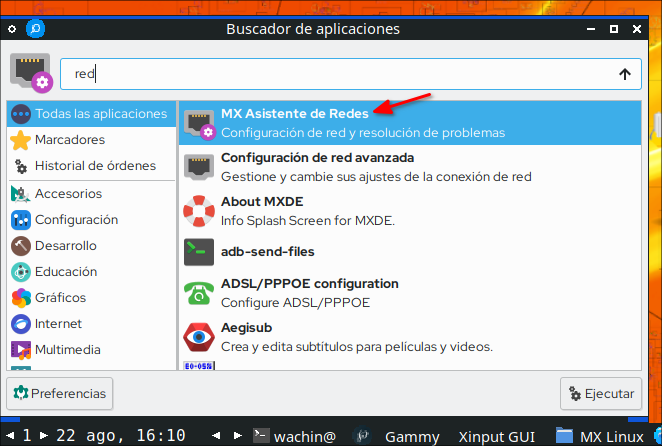

y allí para saber cuál es mi controlador de Wi-Fi , me voy al administrador de Redes de MX Linux, en la primer pestaña "**status**" allí veo que el Wireless (que significa "inalámbrico") es:

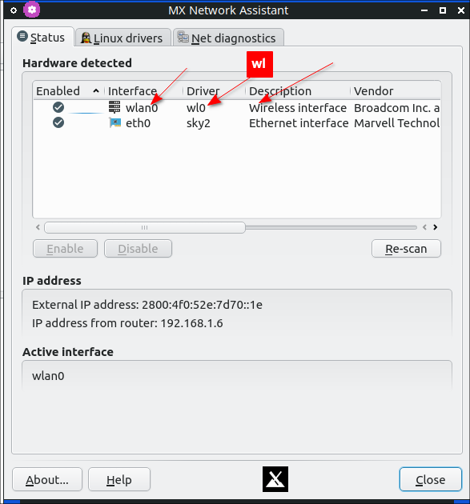

como ahora sé que en mi caso en mi Dell Inspiron 1750 el driver es:

lw

en la segunda pestaña clic en ése "**wl**" y luego clic en "**Unload Driver**":

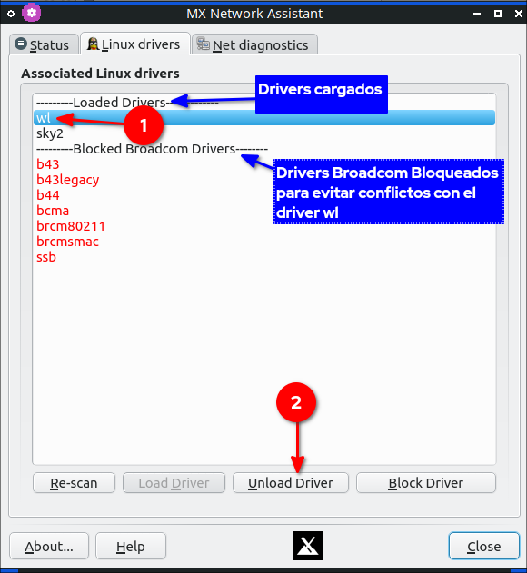

con eso descargaba el driver (no se refiere a descargar archivos de internet), y luego lo volvía a cargar (y esperando un rato se conectaba a internet):

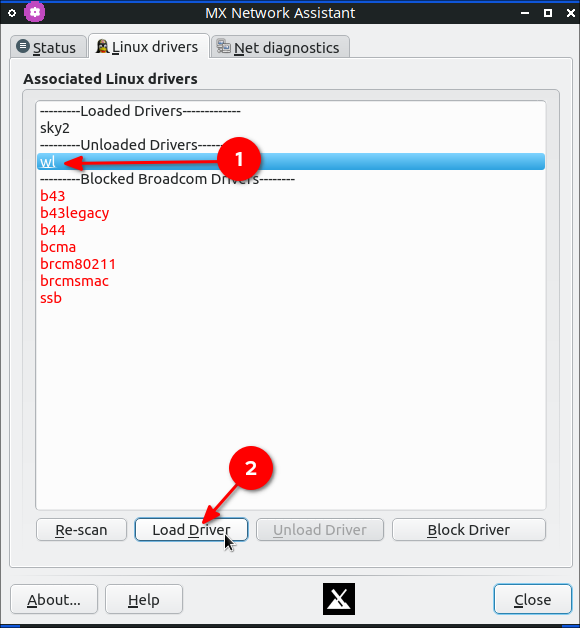

y con eso después que se conectaba tenía internet otra vez:

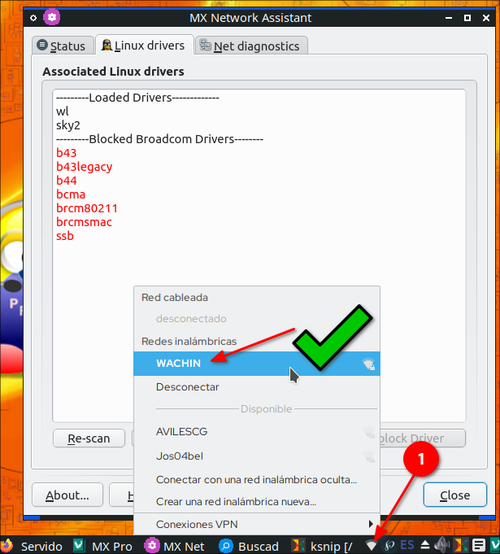

pero con esta solución igual en algún momento me volvía a quedar sin internet:

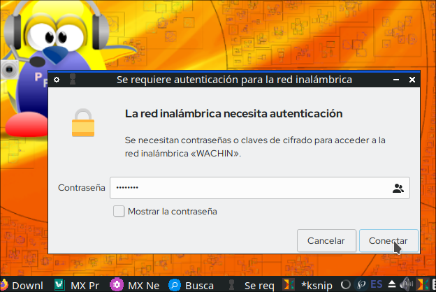

 pues se desconectaba y tenía que repetir el proceso otra vez.
 

# Nueva  solución mejorada, bloquear el que no funciona bien, añadir el que si al inicio
Lo siguiente es sólo en mi caso con la Dell Inpiron 1750, pero lo pueden usar como consulta para tal vez arreglar algún problema parecido en alguna otra laptop.

Yo se que el hardware del controlador del Wi-Fi de mi laptop es Broadcom porque allí mismo dice:

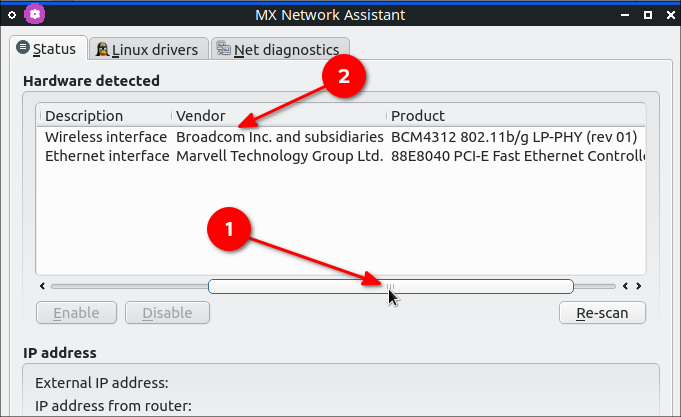

así que un día me puse a pensar el tratar de usar otro driver y así lo hice con prueba y error (en mi caso probé cada uno de los drivers de mi lista: b43, b43legacy, b44, bcma, brcm80211, brcmsmac, ssb). El siguiente es el driver que me funcionó:

**b43**

Entonces la solución total para mí es  **bloquear** el driver anterior, así:

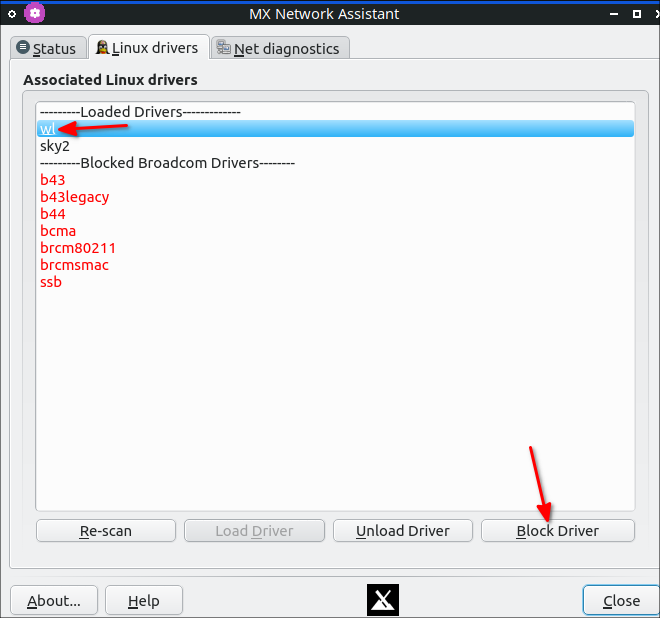

**Nota**: Al dejarlo bloqueado núnca más se volverá a cargar (exepto que lo desbloquee claro).

y seleccionar el driver:

**b43**

y cargarlo dando clic en "**Load Driver**":
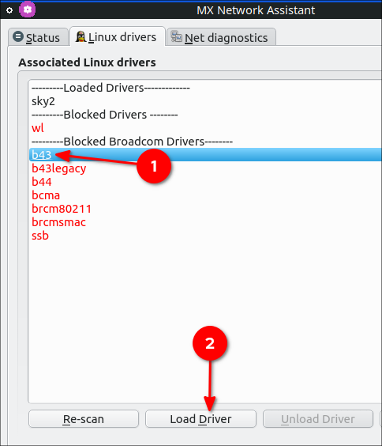

y esperar un momento a que automáticamente se conecte (pueden ser algunos minutos):

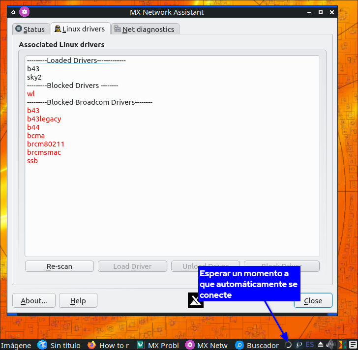

y ya hay internet otra vez:

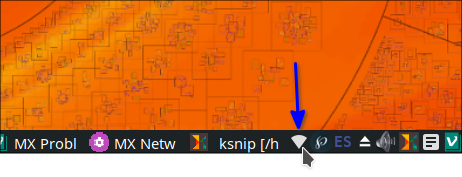
si desea que se cargue rapido Re-scan:

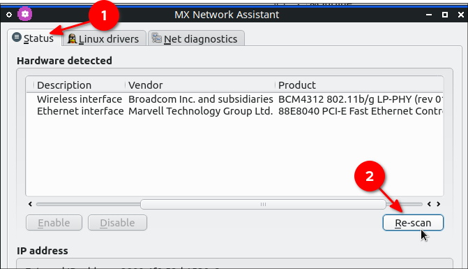

## Añadir el modulo del driver al inicio
Ponga en una terminal para el editor de texto Gedit:

    sudo gedit /etc/modules

allí añada el modulo:

b43

debe quedarle así:

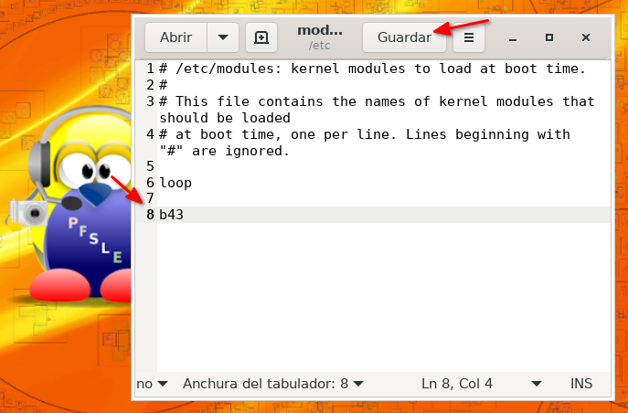

y guarde y cierre Gedit. Al reiniciar la laptop se cargará automáticamente el modulo y el WiFi funcionará

**Nota:** Puede usar otro editor de texto, sólo modifique la línea y ponga el suyo.

# Si es curioso (Opcional)
Sólo si es curioso, la interfaz gráfica de "MX Asistente de Redes" lo que hace es modificar los archivos en:

/etc/modprobe.d/

en mi caso de la Dell Inspiron 1750 los driver bloqueados para evitar conflictos con wl fueron:

/etc/modprobe.d/broadcom-sta-dkms.conf

**Nota**: Esto sólo es en mi caso, en el suyo es posible que sea otro archivo.

si gusta puede abrir ese archivo con algún editor de texto.

También si desea ver el driver cargado, en mi caso yo se  que el que me funciona bien se llama b43 y como ya lo he cargado lo puedo ver en el sistema poniendo en una terminal:

    lsmod

así me aparece:

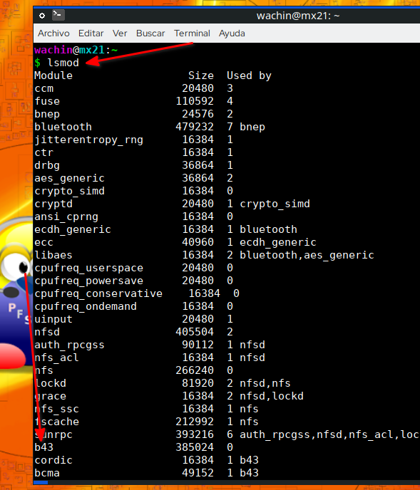

También lo puedo ver con:

    dmesg | grep firmware

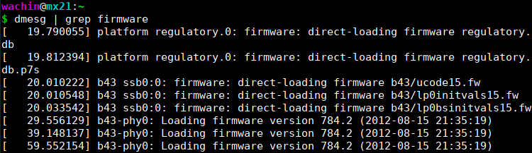

Que Dios les bendiga

 
**CONSULTAS:**

Network configuration/Wireless - ArchWiki
https://wiki.archlinux.org/title/Network_configuration/Wireless

Kernel module - ArchWiki
https://wiki.archlinux.org/title/Kernel_module#Automatic_module_loading

14.04 - Automatically load module on system startup - Ask Ubuntu
https://askubuntu.com/questions/607962/automatically-load-module-on-system-startup
https://askubuntu.com/a/996571/145772

startup - Which system file is loading the "wl" (wifi) kernel module at boot time? - Unix & Linux Stack Exchange
https://unix.stackexchange.com/questions/222358/which-system-file-is-loading-the-wl-wifi-kernel-module-at-boot-time

