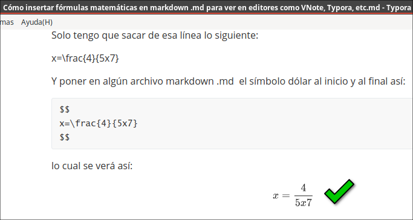
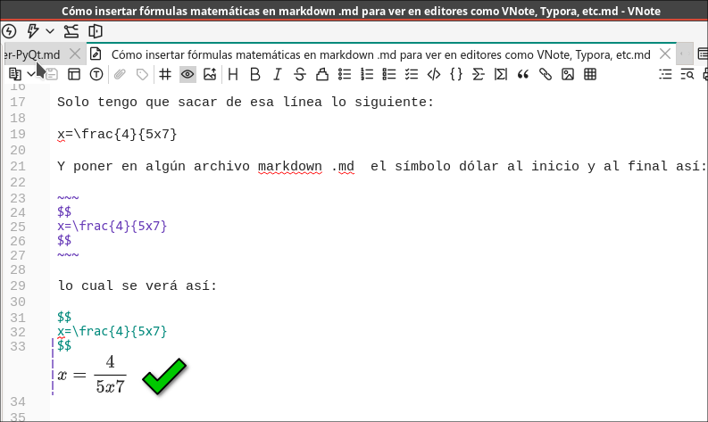
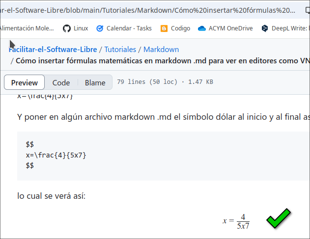
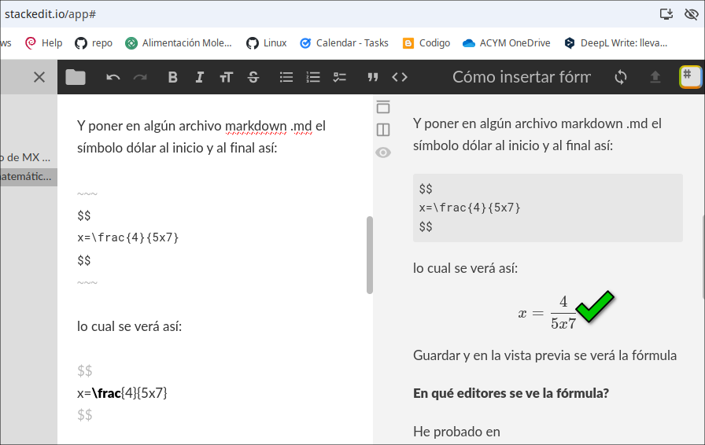
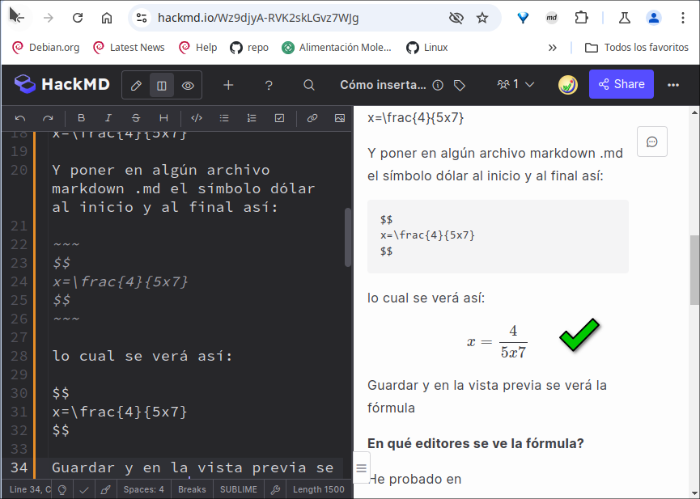

# Cómo insertar fórmulas matemáticas en markdown .md para ver en editores como VNote, Typora, etc

Para VNote, Typora y otros:

En el siguiente servicio online:

[https://editor.codecogs.com/](https://editor.codecogs.com/)

Escribí:

x=\frac{4}{5x7} 

y me da abajo: 

[https://latex.codecogs.com/svg.image?x=\frac{4}{5x7}}](https://latex.codecogs.com/svg.image?x=\frac{4}{5x7})

Solo tengo que sacar de esa línea lo siguiente: 

x=\frac{4}{5x7}

Y poner en algún archivo markdown .md  el símbolo dólar al inicio y al final así:

~~~
$$
x=\frac{4}{5x7}
$$
~~~

lo cual se verá así:

$$
x=\frac{4}{5x7}
$$

Guardar y en la vista previa se verá la fórmula

**En qué editores se ve la fórmula?**
He probado en:

- Typora

- NVote 

- [https://github.com/](https://github.com/)

- [https://stackedit.io/](https://stackedit.io/)

- [https://hackmd.io/](https://hackmd.io/)

- Debe verse en algún otro pero no he probado

**En qué editores NO se ve la fórmula?**
- Ghostwriter
- Apostrofe
- ReText
- Formiko

Nota: Se verá también en GitHub.

## Otros servicios para crear fórmulas matemáticas

Los siguientes servicios online también sirven para crear fórmulas, pero hay que saber usar latex

Math Live
https://cortexjs.io/mathlive/demo/

Matcha (Abrir el editor -investigar cómo funciona-)
https://www.mathcha.io/

(No funciona bien en Celular)
https://latexeditor.lagrida.com/

equatheque
https://visualmatheditor.equatheque.net/

wiris
https://demo.wiris.com/mathtype/en/developers.php

hostmath
https://www.hostmath.com/

Investigar:
https://asciimath.org/
https://www.mathpearl.com/