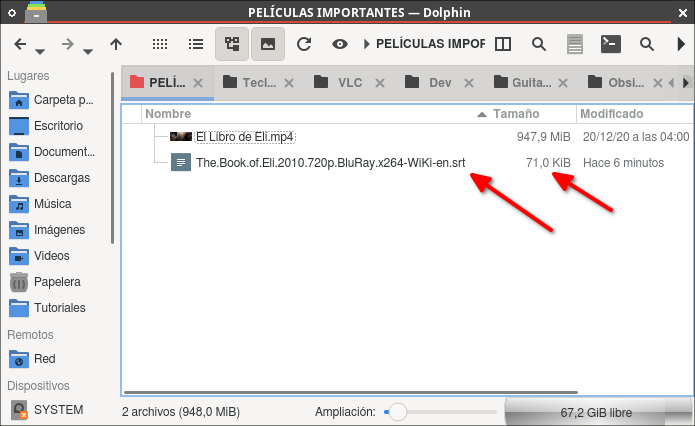
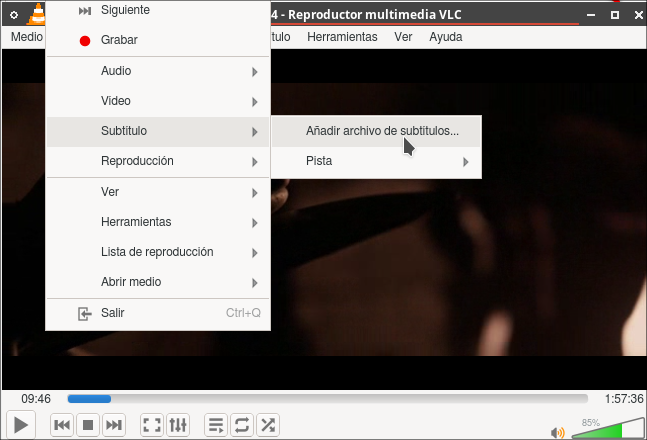
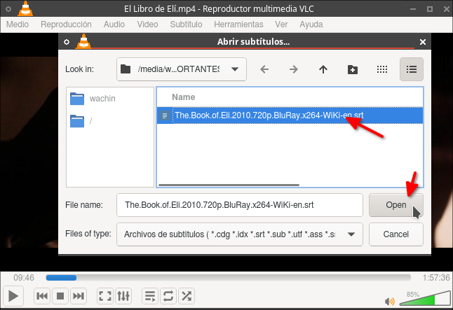
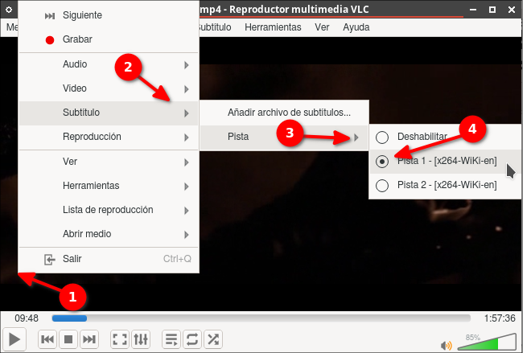
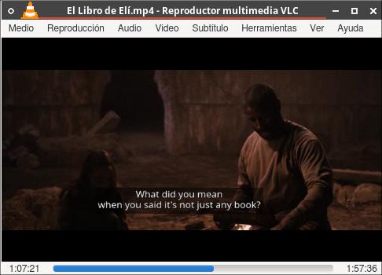
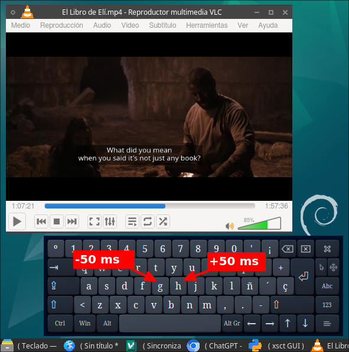
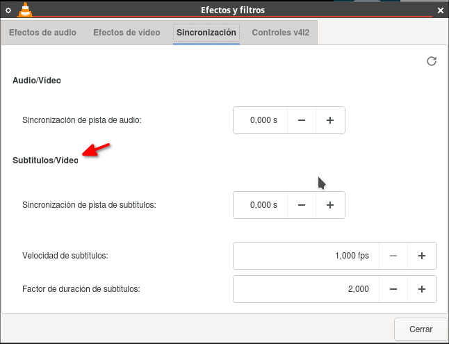

# Sincronización de subtítulos en VLC, el subtítulo está adelantado o retrasado

Estoy viendo una película en inglés en VLC y he descargado un subtitulo en ingles:

y para cargarlo:

lo elijo:

selecciono el subtítulo:

y me queda así:

Si desea puede ver mi entrada:

**Poner - Tapar con fondo negro a subtítulo en VLC**
[https://facilitarelsoftwarelibre.blogspot.com/2017/12/poner-tapar-con-fondo-negro-subtitulo.html](https://facilitarelsoftwarelibre.blogspot.com/2017/12/poner-tapar-con-fondo-negro-subtitulo.html)

pero está defasado por como tres segundos en adelante. 

En VLC se puede ajustar la sincronización de los subtítulos fácilmente mientras se ve la película.

**Instrucciones:**

1. **Usando atajos de teclado:**
   - **Adelantar subtítulos:** Presiona **H** para adelantar los subtítulos si están desfasados (aparecen antes de lo que deberían). Cada pulsación adelanta los subtítulos unos +50 ms:
   
   - **Atrasar subtítulos:** Presiona **G** para retrasar los subtítulos si están adelantados respecto a la acción en la pantalla. Cada pulsación retrasa los subtítulos unos -50 ms.
   

**Nota:** El teclado que ven allí es onboard en Debian 12 de 32 bit

2. **Desde el menú (mayor precisión):**
   - Ve a **Herramientas > Sincronización de pistas**.
   - En la sección "Sincronización de subtítulos", ajusta el tiempo en milisegundos (ms) para adelantar o atrasar los subtítulos.
   

Con estas opciones puedes sincronizar los subtítulos en tiempo real mientras ves la película.

Dios te bendiga
