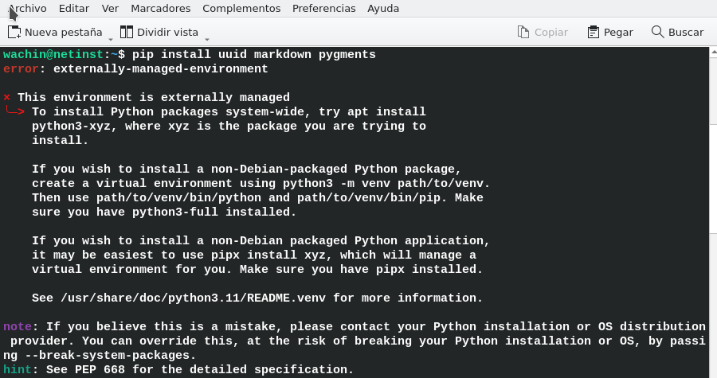

 

# pip no me deja instalar paquetes de python en Debian 12

Instalé Debian 12 y cuando trato de in

1. Install the necessary packages

apt update
sudo apt install python3 python3-pip 

y traté de instalar unos paquetes usando pip, ejemplo:


pip install requests

pero no se puede, me aparece este mensaje:

```
wachin@netinst:~$ pip3 install requests
error: externally-managed-environment

× This environment is externally managed
╰─> To install Python packages system-wide, try apt install
    python3-xyz, where xyz is the package you are trying to
    install.
    

​```
If you wish to install a non-Debian-packaged Python package,
create a virtual environment using python3 -m venv path/to/venv.
Then use path/to/venv/bin/python and path/to/venv/bin/pip. Make
sure you have python3-full installed.

If you wish to install a non-Debian packaged Python application,
it may be easiest to use pipx install xyz, which will manage a
virtual environment for you. Make sure you have pipx installed.

See /usr/share/doc/python3.11/README.venv for more information.
​```

note: If you believe this is a mistake, please contact your Python installation or OS distribution provider. You can override this, at the risk of breaking your Python installation or OS, by passing --break-system-packages.
hint: See PEP 668 for the detailed specification.
```





## Solución usar un Entorno Virtual

Instalar:

```
sudo apt install python3.*-venv
```

Ahora necesitamos usar el comando "python3 -m venv .venv" que se utiliza para crear un entorno virtual en Python. Poner en la terminal:

```
python3 -m venv .venv
```

 donde:

- `python3`: Indica que se usará Python 3.
- `-m venv`: Ejecuta el módulo `venv` que es el encargado de crear entornos virtuales.
- `.venv`: Especifica el nombre y la ubicación del directorio donde se creará el entorno virtual. En este caso, se creará una carpeta llamada `.venv` en el directorio actual.

Un entorno virtual es una herramienta que permite mantener dependencias y paquetes específicos para un proyecto aislado del sistema global de Python. Esto es especialmente útil para evitar conflictos entre versiones de paquetes en diferentes proyectos.

### Pasos adicionales

1. **Activar el entorno virtual**:
   - En Linux y macOS:
     ```sh
     source .venv/bin/activate
     ```
   - En Windows:
     ```sh
     .venv\Scripts\activate
     ```

2. **Instalar paquetes** dentro del entorno virtual:
   ```sh
   pip install nombre_del_paquete
   ```

3. **Desactivar el entorno virtual** cuando ya no lo necesites:
   ```sh
   deactivate
   ```

¿Te gustaría más información sobre cómo utilizar los entornos virtuales en Python?


wachin@mx21:~/Dev-Python
$ python3 --version
Python 3.9.2
OK

source .venv/bin/activate

esto creará:

/home/wachin/Dev-Python/.venv/

instalar:

pip3 install pip install basic-pitch

Pero no funcionó la instalación, algo entró en conflicto


CONSULTAS

Debian 12 Linux Transcription server (Python, VOSK, Script)
https://synay.net/en/vps/preconfigured/transcription-server-debian-12-audio-to-text-translation