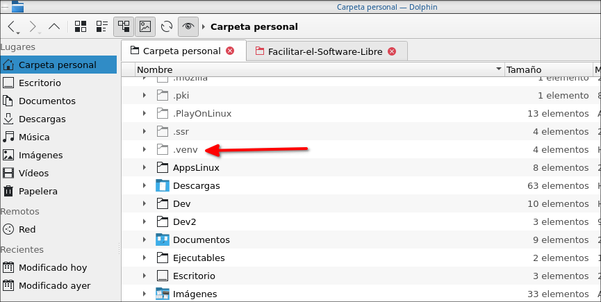

# pip no me deja instalar paquetes de python en Debian 12
Instalé Debian 12 y cuando trato de instalar paquetes con pip no puedo. La siguiente es la solución:

1.) Instalar las dependencias necesarias:

```
apt update
```

```
sudo apt install python3 python3-pip
```

 y traté de instalar unos paquetes usando pip, ejemplo:

```
pip install requests
```

pero no se puede, me aparece este mensaje:

```
wachin@netinst:~$ pip3 install requests
error: externally-managed-environment

× This environment is externally managed
╰─> To install Python packages system-wide, try apt install
    python3-xyz, where xyz is the package you are trying to
    install.

If you wish to install a non-Debian-packaged Python package,
create a virtual environment using python3 -m venv path/to/venv.
Then use path/to/venv/bin/python and path/to/venv/bin/pip. Make
sure you have python3-full installed.

If you wish to install a non-Debian packaged Python application,
it may be easiest to use pipx install xyz, which will manage a
virtual environment for you. Make sure you have pipx installed.

See /usr/share/doc/python3.11/README.venv for more information.

note: If you believe this is a mistake, please contact your Python installation or OS distribution provider. You can override this, at the risk of breaking your Python installation or OS, by passing --break-system-packages.
hint: See PEP 668 for the detailed specification.
```

a continuación pongo una captura de pantalla:


## Solución usar un Entorno Virtual

Instalar:

```
sudo apt install python3.*-venv
```

Ahora necesitamos usar el comando "python3 -m venv .venv" que se utiliza para crear un entorno virtual en Python. Poner en la terminal:

```
python3 -m venv .venv
```

 donde:

- `python3`: Indica que se usará Python 3.
- `-m venv`: Ejecuta el módulo `venv` que es el encargado de crear entornos virtuales.
- `.venv`: Especifica el nombre y la ubicación del directorio donde se creará el entorno virtual. En este caso, se creará una carpeta llamada `.venv` en el directorio actual.

Esto creará una carpeta oculta que la podemos ver con Ctrl + H en la mayoría de los administradores de archivos:



Un entorno virtual es una herramienta que permite mantener dependencias y paquetes específicos para un proyecto aislado del sistema global de Python. Esto es especialmente útil para evitar conflictos entre versiones de paquetes en diferentes proyectos.

### Pasos adicionales

1.) **Activar el entorno virtual**

En Linux y macOS:

```
source .venv/bin/activate
```

En Windows:

```
.venv\Scripts\activate
```

2.) **Instalar paquetes** dentro del entorno virtual

```
pip install nombre_del_paquete
```

3.) **Desactivar el entorno virtual** cuando ya no lo necesites:

```
deactivate
```

# Cómo saber si está bien instalado el entorno virtual pip con venv?

Hay un paquete en pip llamado requests, instalarlo así:

```
pip install requests
```

que se puede usar para saber si está bien instalado el entorno virtual de python

El siguiente es un ejemplo sencillo de código en Python que utiliza el paquete `requests` para hacer una solicitud HTTP y verificar si está bien instalado y funcionando, es un script básico:

```python
import requests

def check_requests():
    try:
        response = requests.get('https://jsonplaceholder.typicode.com/todos/1')
        if response.status_code == 200:
            print("El paquete 'requests' está instalado y funciona correctamente.")
            print("Respuesta del servidor:")
            print(response.json())
        else:
            print("El paquete 'requests' está instalado, pero hubo un problema con la solicitud.")
    except Exception as e:
        print("Ocurrió un error:", e)

if __name__ == "__main__":
    check_requests()

```

### Instrucciones para ejecutar el script:

1.) **Asegúrate de que tu entorno virtual esté activado** (este paso ya lo habíamos hecho):

En Linux y macOS:

```
source .venv/bin/activate
```
​
En Windows:

```
.venv\Scripts\activate
```

2.) **Guarda el script en un archivo** llamado, por ejemplo, `check_requests.py`.

3.) **Ejecuta el script**:

```
python3 check_requests.py
```

### Qué hace el script:

- Importa el módulo `requests`.
- Define una función `check_requests` que hace una solicitud GET a un endpoint de prueba (`https://jsonplaceholder.typicode.com/todos/1`).
- Verifica si la solicitud fue exitosa (código de estado 200).
- Imprime un mensaje confirmando que el paquete `requests` está instalado y funcionando correctamente.
- Imprime la respuesta JSON obtenida del servidor para que puedas ver que la solicitud se realizó correctamente.
- Maneja cualquier excepción que pueda ocurrir durante la solicitud.

Si el paquete `requests` está correctamente instalado y no hay problemas de conexión a internet, deberías ver un mensaje indicando que está funcionando, junto con los datos obtenidos de la solicitud.

A mi me devuelve:


está correcto.

# Y cómo hago para después que haya apagado mi ordenador y entrado otra vez activar el entorno

Para activar el entorno virtual poner otra vez en una terminal:

En Linux y macOS:

```
source .venv/bin/activate
```

En Windows:

```
.venv\Scripts\activate
```

y allí instalar y hacer lo que uno necesite

## REFERENCIAS

- **Documentación oficial de Python: Entornos virtuales y módulos `venv`**:
Python Software Foundation. (2023). *The Python Standard Library: venv*. Recuperado de [https://docs.python.org/3/library/venv.html](https://docs.python.org/3/library/venv.html).

- **Documentación oficial del paquete `requests`**:
Kenneth Reitz & Python Software Foundation. (2023). *Requests: HTTP for Humans*. Recuperado de [https://docs.python-requests.org/en/latest/](https://docs.python-requests.org/en/latest/).
